# 简介
[**sofa-pbrpc**](https://github.com/baidu/sofa-pbrpc)是基于Google Protocol Buffers 实现的RPC网络通信库，在百度公司各部门得到广泛使用，每天支撑上亿次内部调用。sofa-pbrpc基于百度大搜索高并发高负载的业务场景不断打磨，成为一套简单易用的轻量级高性能RPC框架。2014年sofa-pbrpc正式对外开源受到广大开发人员的关注，目前sofa-pbrpc已经在各大互联网公司产品中使用。

开源地址：[https://github.com/baidu/sofa-pbrpc](https://github.com/baidu/sofa-pbrpc)

# 目标
* 轻量
* 稳定
* 高性能
* 易用

# 特性
* 接口简单，容易使用
* 实现高效，性能优异（高吞吐、低延迟、高并发连接数）
* 测试完善，运行稳定
* 支持同步和异步调用，满足不同类型需求
* 支持多级超时设定，灵活控制请求超时时间
* 支持精准的网络流量控制，对应用层透明
* 支持透明压缩传输，节省带宽
* 提供服务和方法级别的服务调用统计信息，方便监控
* 支持自动建立连接和自动重连，用户无需感知连接
* 远程地址相同的Client Stub共享一个连接通道，节省资源
* 空闲连接自动关闭，及时释放资源
* 支持Mock测试
* 支持多Server负载均衡与容错
* 原生支持HTTP协议访问
* 提供内建的Web监控页面
* 提供Python客户端库
* 支持webservice，用户快速定义web server处理逻辑
* 支持profiling，实时查看程序的资源消耗，方便问题追查

<div  align="center">
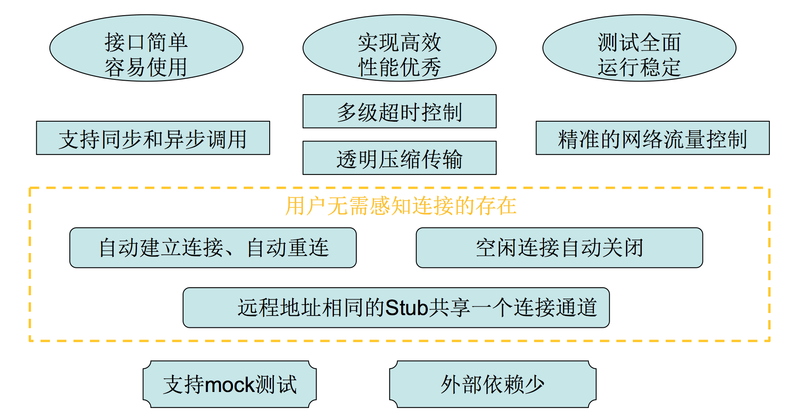
</div>

# 接口

## 主要接口类
主要用户接口分为四个接口类和三个option。
<div  align="center">
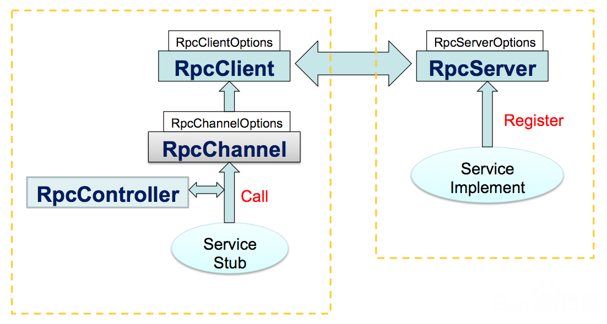
</div>

## 用户配置
Server端配置：RpcServerOptions

| 参数名        | 参数说明         |
| :-------------: |:-------------:|
|work_thread_num|工作线程数 |
|max_pending_buffer_size|pengding buffer 大小 (MB) |
|max_throughput_in|最大入带宽限制 (MB/s) |
|max_throughput_out|最大出带宽限制 (MB/s)|
|keep_alive_time|空闲连接维持时间 (s) |

Client端配置：RpcClientOptions

| 参数名        | 参数说明         |
| :-------------: |:-------------:|
|work_thread_num|工作线程数 |
|callback_thread_num|回调线程数 |
|max_pending_buffer_size|pengding buffer 大小 (MB) |
|max_throughput_in|最大入带宽限制 (MB/s) |
|max_throughput_out|最大出带宽限制 (MB/s)|

# 快速使用
使用sofa-pbrpc只需要三步：
* 定义通讯协议
* 实现Server
* 实现Client

样例代码参见[sample/echo](https://github.com/baidu/sofa-pbrpc/tree/master/sample/echo)。
## 定义通讯协议
定义协议只需要编写一个proto文件即可。
范例：echo_service.proto

```c++
package sofa.pbrpc.test;
option cc_generic_services = true;
message EchoRequest {
    required string message = 1;
}
message EchoResponse {
    required string message = 1;
}
service EchoServer {
    rpc Echo(EchoRequest) returns(EchoResponse);
}
```
使用protoc编译'echo_service.proto'，生成接口文件'echo_service.pb.h'和'echo_service.pb.cc'。

>**注意：**
* package会被映射到C++中的namespace，为了避免冲突建议使用package；
* 需要设置“cc_generic_services”，以通知protoc工具生成RPC框架代码；
* 这里EchoRequest和EchoResponse的成员完全相同，在实际应用中可以设置不同的成员；

## 实现Server
### 头文件

```c++
#include <sofa/pbrpc/pbrpc.h>  // sofa-pbrpc头文件
#include "echo_service.pb.h"   // service接口定义头文件
```

### 实现服务

```c++
class EchoServerImpl : public sofa::pbrpc::test::EchoServer
{
public:
    EchoServerImpl() {}
    virtual ~EchoServerImpl() {}

private:
    virtual void Echo(google::protobuf::RpcController* controller,
                      const sofa::pbrpc::test::EchoRequest* request,
                      sofa::pbrpc::test::EchoResponse* response,
                      google::protobuf::Closure* done)
    {
        sofa::pbrpc::RpcController* cntl =
            static_cast<sofa::pbrpc::RpcController*>(controller);
        SLOG(NOTICE, "Echo(): request message from %s: %s",
            cntl->RemoteAddress().c_str(), request->message().c_str());
        response->set_message("echo message: " + request->message());
        done->Run();
    }
};
```

> **注意：**
* 服务完成后必须调用done->Run()，通知RPC系统服务完成，触发发送Response；
* 在调了done->Run()之后，Echo的所有四个参数都不再能访问；
done->Run()可以分派到其他线程中执行，以实现了真正的异步处理；

### 注册和启动服务

```c++
int main()
{
    SOFA_PBRPC_SET_LOG_LEVEL(NOTICE);

    sofa::pbrpc::RpcServerOptions options;
    options.work_thread_num = 8;
    sofa::pbrpc::RpcServer rpc_server(options);

    if (!rpc_server.Start("0.0.0.0:12321")) {
        SLOG(ERROR, "start server failed");
        return EXIT_FAILURE;
    }

    sofa::pbrpc::test::EchoServer* echo_service = new EchoServerImpl();
    if (!rpc_server.RegisterService(echo_service)) {
        SLOG(ERROR, "register service failed");
        return EXIT_FAILURE;
    }
    rpc_server.Run();
    rpc_server.Stop();

    return EXIT_SUCCESS;
}
```

## 实现Client

Client支持同步和异步两种调用方式：
* 同步调用时，调用线程会被阻塞，直到收到回复或者超时；
* 异步调用时，调用线程不会被阻塞，收到回复或者超时会调用用户提供的回调函数；

### 头文件

```c++
#include <sofa/pbrpc/pbrpc.h>  // sofa-pbrpc头文件
#include "echo_service.pb.h"   // service接口定义头文件
```
### 同步调用

```c++
int main()
{
    SOFA_PBRPC_SET_LOG_LEVEL(NOTICE);
    sofa::pbrpc::RpcClientOptions client_options;
    client_options.work_thread_num = 8;
    sofa::pbrpc::RpcClient rpc_client(client_options);
    sofa::pbrpc::RpcChannel rpc_channel(&rpc_client, "127.0.0.1:12321");
 
    sofa::pbrpc::test::EchoServer_Stub stub(&rpc_channel);
 
    sofa::pbrpc::test::EchoRequest request;
    request.set_message("Hello world!");
    sofa::pbrpc::test::EchoResponse response;
    sofa::pbrpc::RpcController controller;
    controller.SetTimeout(3000);
    stub.Echo(&controller, &request, &response, NULL);
    if (controller.Failed()) {
        SLOG(ERROR, "request failed: %s", controller.ErrorText().c_str());
    }

    return EXIT_SUCCESS;
}
```
### 异步调用

```c++
void EchoCallback(sofa::pbrpc::RpcController* cntl,
        sofa::pbrpc::test::EchoRequest* request,
        sofa::pbrpc::test::EchoResponse* response,
        bool* callbacked)
{
    SLOG(NOTICE, "RemoteAddress=%s", cntl->RemoteAddress().c_str());
    SLOG(NOTICE, "IsRequestSent=%s", cntl->IsRequestSent() ? "true" : "false");
    if (cntl->IsRequestSent())
    {
        SLOG(NOTICE, "LocalAddress=%s", cntl->LocalAddress().c_str());
        SLOG(NOTICE, "SentBytes=%ld", cntl->SentBytes());
    }
    if (cntl->Failed()) {
        SLOG(ERROR, "request failed: %s", cntl->ErrorText().c_str());
    }
    else {
        SLOG(NOTICE, "request succeed: %s", response->message().c_str());
    }
    delete cntl;
    delete request;
    delete response;

    *callbacked = true;
}

int main()
{
    SOFA_PBRPC_SET_LOG_LEVEL(NOTICE);

    sofa::pbrpc::RpcClientOptions client_options;
    sofa::pbrpc::RpcClient rpc_client(client_options);

    sofa::pbrpc::RpcChannel rpc_channel(&rpc_client, "127.0.0.1:12321");
    sofa::pbrpc::test::EchoServer_Stub stub(&rpc_channel);
    sofa::pbrpc::test::EchoRequest* request = new sofa::pbrpc::test::EchoRequest();
    request->set_message("Hello from qinzuoyan01");
    sofa::pbrpc::test::EchoResponse* response = new sofa::pbrpc::test::EchoResponse();
    sofa::pbrpc::RpcController* cntl = new sofa::pbrpc::RpcController();
    cntl->SetTimeout(3000);
    bool callbacked = false;
    google::protobuf::Closure* done = sofa::pbrpc::NewClosure(
            &EchoCallback, cntl, request, response, &callbacked);

    stub.Echo(cntl, request, response, done);
    while (!callbacked) {
        usleep(100000);
    }

    return EXIT_SUCCESS;
}
```
> **注意：**
* 异步调用传入的controller、request、response参数，在回调函数执行之前需一直保持有效；
* 回调函数的执行会分配到专门的回调线程中运行，可以通过设置RpcClientOptions的callback_thread_num来配置回调线程数；

# 工具
## sofa-pbrpc-client
* 查询server的健康状况（health）、配置参数（option）、负载情况（status）
* 查询server对外提供的服务列表（list）
* 获取服务相关的protobuf类型描述信息（desc）
* 使用text格式的请求数据，向server指定Method发送rpc请求调用（call）
* 获取服务的统计信息，包括处理请求数、平均处理时间、最大处理时间等（stat）

# 实现
## 系统结构

<div  align="center">
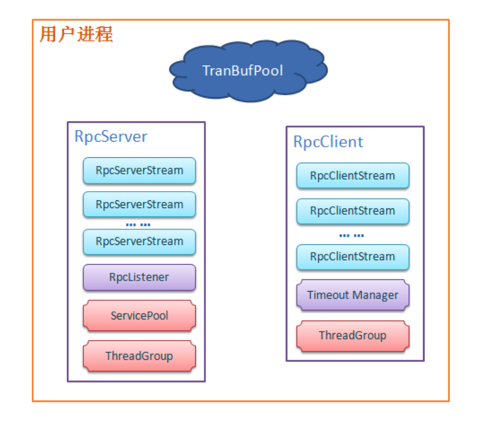
</div>
* RpcClientStream/RpcServerStream：代表client和server之间的连接，用于client和server的网络通信。
* ThreadGroup：client和server内部线程池，用于io操作和执行回调。
* TimeoutManager：采用订阅者模型，对rpc请求进行超时管理。
* RpcListenser：接受来自client的连接请求，创建与client之间的连接。
* ServicePool：server端服务管理与路由。

## 设计原理

### 网络模型
#### 网络协议栈

在sofa-pbrpc中网络数据自上而下流划分为RpcClientStream/RpcServerStream、RpcMessageStream、RpcByteStream三层。字节流层主要负责网络通信相关的操作，操作对象为序列化后的二机制字节流；消息流层处理的对象是由header、meta和data组装的消息，负责消息级别的控制与统计；协议层负责异步发送请求和接收响应数据。采用这样协议栈方式的层次划分更加有利于数据协议的扩展。
<div  align="center">
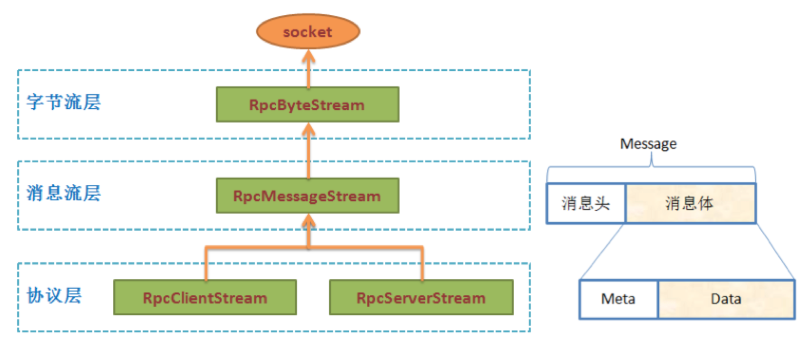
</div>

#### RPC 协议
一条rpc消息由RpcMessageHeader、RpcMeta和Data组成。
<div  align="center">

</div>

```c++
struct RpcMessageHeader {
    union {
        char    magic_str[4];
        uint32  magic_str_value;
    };                    // 4 bytes
    int32   meta_size;    // 4 bytes
    int64   data_size;    // 8 bytes
    int64   message_size; // 8 bytes: message_size = meta_size + data_size, for check

    RpcMessageHeader()
        : magic_str_value(SOFA_RPC_MAGIC)
        , meta_size(0), data_size(0), message_size(0) {}

    bool CheckMagicString() const
    {
        return magic_str_value == SOFA_RPC_MAGIC;
    }
};
```

```c++
message RpcMeta {
  enum Type {
    REQUEST = 0;
    RESPONSE = 1;
  };
  required Type type = 1;
  required uint64 sequence_id = 2;
  optional string method = 100;
  optional int64 server_timeout = 101;
  optional bool failed = 200;
  optional int32 error_code = 201;
  optional string reason = 202;
  optional CompressType compress_type = 300;
  optional CompressType expected_response_compress_type = 301;
}
```

一次RPC调用经过以下流程:

1. Stub调用RPC函数发起RPC请求。
2. RpcChannel调用CallMethod执行RPC调用。
3. RpcClient选取RpcClientStream异步发送请求，并添加至超时队列。
4. server端RpcListener接收到client的连接，创建对应RpcServerStream。
5. RpcServerStream接收数据，根据meta信息在ServicePool中选取对应Service.Method执行。
6. server通过RpcServerStream发送执行结果，回复过程与请求过程类似。
<div  align="center">
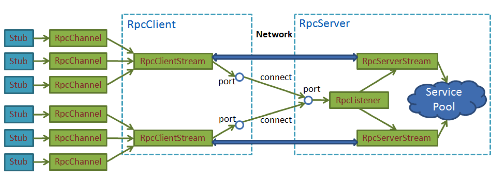
</div>

### 线程模型
asio异步模型，底层使用epoll。
<div  align="center">
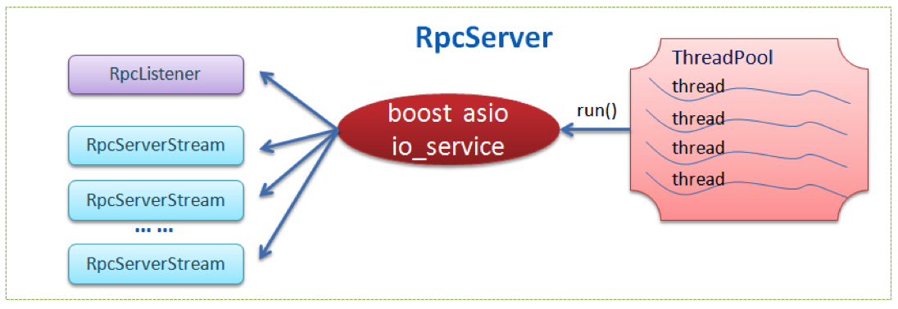
</div>
<div  align="center">
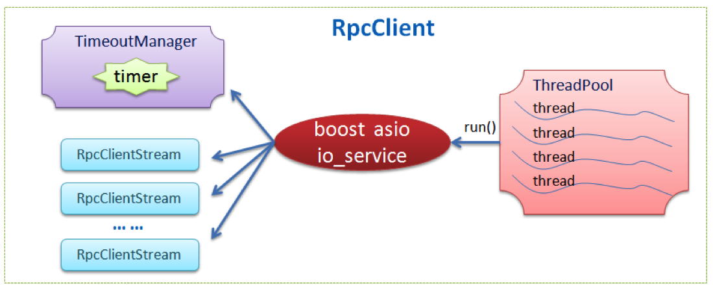
</div>
### 缓冲区管理
sofa-pbrpc将内存划分为固定大小的buffer作为缓冲区，对buffer采用引用计数进行管理，减少不必要的内存拷贝。
<div  align="center">

</div>
<div  align="center">
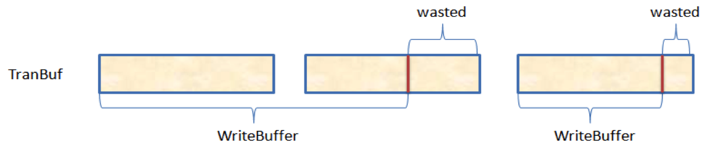
</div>
### 透明压缩
采用装饰者模式的透明压缩，易于扩展。
<div  align="center">
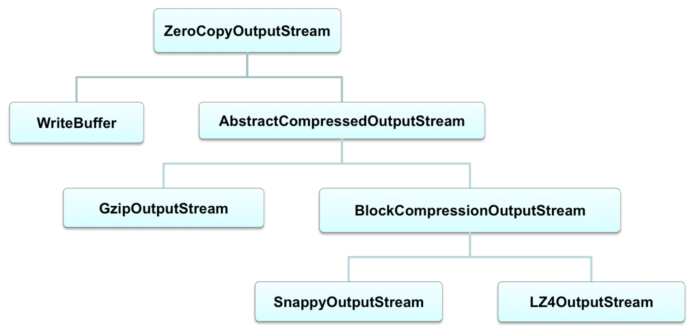
</div>
### 超时管理
使用lock+swap操作缩小临界区。
<div  align="center">
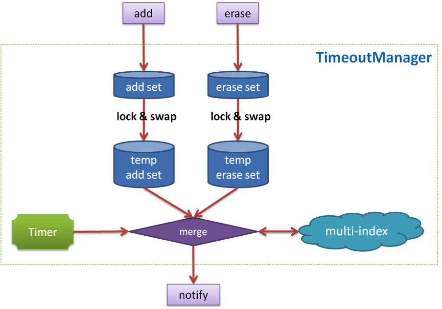
</div>
### 流量控制
按时间片分配流量配额，保证流控精准高效。
<div  align="center">
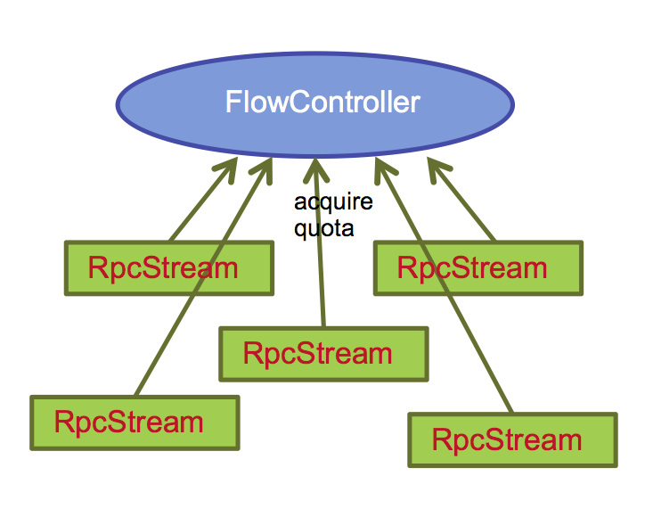
</div>

<div  align="center">
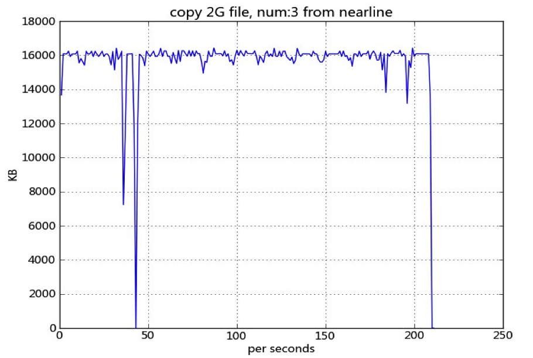
</div>
# 技术特点
## 支持HTTP协议
除了使用原生client访问server外，sofa-pbrpc也支持使用http协议访问server上的服务。同时，用户可以通过使用server端的WebService工具类，快速实现server的对于http请求的处理逻辑。
## 支持json格式数据传输
sofa-pbrpc支持用户使用http客户端向server发送json格式的数据请求，并返回json格式的响应。
## 提供丰富的工具类
sofa-pbrpc提供常用工具类给开发者，包括：

| 类别        | 头文件           | 说明  |
| :-------------: |:-------------:| :-----:|
| 智能指针 |sofa/pbrpc/smart_ptr/smart_ptr.hpp |包括scoped_ptr,shared_ptr,weak_ptr等 |
| 原子操作 |sofa/pbrpc/atomic.h                |支持fetch,inc,dec,cas等              |
| 锁操作   |sofa/pbrpc/locks.h                 |提供了互斥锁,自旋锁,读写锁的封装       |
| 定时管理 |sofa/pbrpc/timeout_manager.h       |高效的提供了定时器功能                |

# 支持团队
百度网页搜索部开源团队 [opensearch@baidu.com](opensearch@baidu.com)
